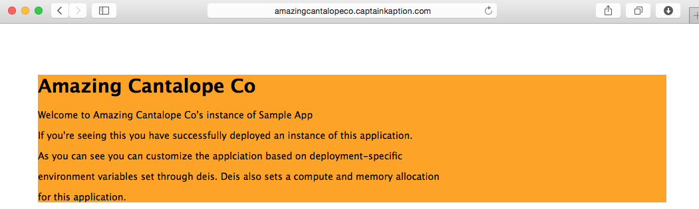

# Deploying Customizable Applications using Deis Contoller API from a Docker Registry

Although one of the best things about [Deis]() is the fact that you can deploy your apps using the developer-friendly `git push` Deis also supports deploying apps from Docker images hosted by docker registry server.

Even cooler - Deis exposes a [controller API](http://docs.deis.io/en/latest/reference/api-v1.1/) which allows you to integrate application management from any application. There's also a couple nice API wrappers such as the [node.js](https://github.com/aledbf/deis-api) wrapper written by one of the [maintainers](https://github.com/aledbf). We'll use this api wrapper in this example.

Why is this cool? You can deploy hundreds of 'apps' backed by the same image and tweak each app using deployment-specific variables set by Deis via Environment variables.

## Getting your Deis Cluster

Follow the instructions on [Deis.io](http://deis.io/get-deis/) to install Deis on your cloud platform of choice such as [Microsoft Azure](http://docs.deis.io/en/latest/installing_deis/azure/). Be sure register a user to your cluster by doing:

```
deis register
```
Save the credentials you've used, you'll need them later

## Deploying the Customizable App Image to Registry

For this example, we'll be using this quick simple [express app](./deis-api-app), a submodule within this repo which uses simple jade templating to display the organization's name, plus change the background color depending on what we choose at deploy-time.

First, you need to build & push the docker image to the docker hub. You can also push this to your private registry, but you'd have to make sure you have one running.

```
# build image
cd ./deis-api-app
docker build -t <your_dockerhub_username>/simple-node:latest .
docker push <your_dockerhub_username>/simple-node:latest

```

## Run the Example

To run the final example in this repo, modify [./config.json](./config.json) with your specific values:

```json
{
    "deis_host": "deis.captainkaption.com",
    "deis_user": "sedouard",
    "deis_password": "051589",
    "docker_hub_username": "sedouard"
}
```

```
npm install
node app.js
? Please specify a name for the application instance to deploy: sprockets-co
? Please specify a name for the organization: Sprockets Co.
? Please specify a background color: Green
? Please specify the maximum memory allocated to the instance: 512M
? Please specify the maximum cpu time allocated to the instance: 256
creating app: sprockets-co
successfully logged into deis
{ uuid: 'e7423cef-791d-435e-9e6a-63e67b9a28e7',
  id: 'sprockets-co',
  owner: 'sedouard',
  url: 'sprockets-co.captainkaption.com',
  structure: {},
  created: '2015-05-20T16:59:24UTC',
  updated: '2015-05-20T16:59:24UTC' }
sucessfuly created app: sprockets-co
setting deployment specific variables
sucessfully set deployment-specific variables
{ owner: 'sedouard',
  app: 'sprockets-co',
  image: 'sedouard/simple-node:latest',
  sha: '',
  procfile: {},
  dockerfile: '',
  created: '2015-05-20T16:59:25UTC',
  updated: '2015-05-20T16:59:25UTC',
  uuid: '37a70f80-12ef-4501-b0e3-d7359054406d' }
successfully deployed node.js application
```

You should have output similar to above with the name of your deis url, username and image name differing slightly. Browse to the deployed application URL and you'll see that we have an application with the `ORGANIZATION_NAM` name set to `Sprockets Co.` and the `BG_COLOR` set to `Green`:


We can easily deploy another application with the same image but customize it for another org and change the color to something else.



Remember these specific values demonstrate how you can do interesting things such as link each app to a unique database. To make this most useful for your case, you should take the code example and fit the deployment configuration values from the appropiate data source, use your custom image and integrate to your application.

## Deis Controller API Walk-through

We want to use the Deis Controller API because we want the ability to plug the power of deis apps to any existing infrastrcutreu we have.

For example - if you have a company that hosts an app for people such as [Wordpress.com](http://wordpress.com), [Drupal](http://drupal.com) or [DemocracyOS](http://democracyos.com) this would be super useful to plug into your user-facing application.

This repository has an example application using the [node.js](https://github.com/aledbf/deis-api) deis controller wrapper.

First you need to insantiate a client object and login to the cluster:

```js
var DeisAPI = require('deis-api');
var client = new DeisAPI({
    controller : nconf.get('deis_host'),
    secure     : false,  // Optional
    username   : nconf.get('deis_user'),
    password   : nconf.get('deis_password')
});
```

We'll use the [Inquirer](http://npmjs.com/inquirer) module to extact a few command-line parameters like the **Organization Name**, **Background Color** and cpu & memory limits of the application. In a real-world integration you may replace this with a configuration from your database for the specific user or organization you're hosting the app for.

```js
inquirer.prompt([{
  type: 'input',
  name: 'appName',
  message: 'Please specify a name for the application instance to deploy'
},
{
  type: 'input',
  name: 'orgName',
  message: 'Please specify a name for the organization'
},
{
  type: 'input',
  name: 'bgColor',
  message: 'Please specify a background color'
},
{
  type: 'input',
  name: 'memory',
  message: 'Please specify the maximum memory allocated to the instance'
},
{
  type: 'input',
  name: 'cpu',
  message: 'Please specify the maximum cpu time allocated to the instance'
}]
```

To make the code nicer I decided to use RSVP to wrap the client api library functions in RSVP promises:

```js
client.apps.create = RSVP.denodeify(client.apps.create);
client.auth.login = RSVP.denodeify(client.auth.login);
client.builds.create = RSVP.denodeify(client.builds.create);
client.config.set = RSVP.denodeify(client.config.set);
```

## Calling the API

Now that we have all of our information needed to call the api we'll go ahead and call the api wrapper functions, remember this uses a plain old REST API hosted by your deis cluster so you can do this from any language:

### Authenticate

Authentication is easy and this is the equivalent as doing `deis login` on teh cluster.

```js
console.log('creating app: ' + answers.appName);
  var appName = answers.appName;

  // authenticate
  client.auth.login()
```

### Create the App

This registers the App on deis and allocates a virtual host for the app in the form of `<app_name>.<your_domain>.com`.

```js
  .then(function() {
    console.log('sucessfully logged into deis');
    return client.apps.create(appName);
  })
```

However this step just allocates the app space on Deis but doesn't deploy anything. We'll do that in a later step.

### Setting Deployment-specific Variables

Now we'll use the questions from the user of the example deployer application to set environment variables for this specific deployment:

```js
// setup instance-specific environment variables
  // this could be things such as the organization's name
  .then(function(results) {
    console.dir(results);
    console.log('successfully created app: ' + answers.appName);
    console.log('setting deployment specific variables');
    return client.config.set(results.id, { 
        ORGANIZATION_NAME: answers.orgName, 
        BG_COLOR: answers.bgColor
      },
      {
        memory: { cmd: answers.memory },
        cpu: { cmd: parseInt(answers.cpu) }
      });
  })
```

Notice how we're setting the environment variables `ORGANIZATION_NAME` as well as `BG_COLOR` to the variables collected from the user of this example app. This data however can come from a database, a json file, or anywhere else for your specific use case.

Also one handy thing that comes from Docker is the ability to constrain the containers memory and cpu allocation which Deis takes advantage of. You can set your applications memory and cpu usage allow you to easily offer different levels of service for each application. For example you can set these values low for Free (as in, free beer) instances however you might think about charging users for apps with higher compute allocation.

### Deploying the Docker Image to the Application

Finally to deploy the image, (in our case, our registry is the docker hub) we simply specify the image name and Deis will automatically deploy the application. Deis knows when your docker image exposes an endpoint and will automatically route port `80` or `443` to the virtual host name:

```js
  .then(function(){
    console.log('successfully set deployment-specific variables');
    return client.builds.create(answers.appName, nconf.get('docker_hub_username') + '/simple-node:latest');
  })
  .then(function(results) { 
    console.dir(results);
    return console.log('successfully deployed node.js application');
  })
```

Now after a couple minutes (this application specifically deploys its npm packages on startup) you should see your customized app.
